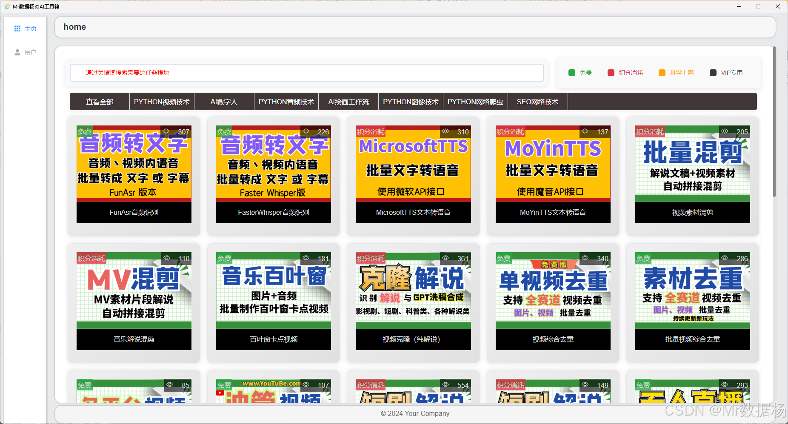

# MyToolsWebBackendUser

【QQ交流群群：670870515】获取最新动态。

项目启动器可以在群文件下载，当前最新版本 v1.06，启动器放在项目下打开即可。

|文档名称|文档描述|文档地址|
|-|-|-| 
|软件下载与安装|整合包下载和安装，分为基础的Django+Tauri和ComfyUI工作流两部分|[点击跳转MD](doc/软件下载与安装.md ':include :type=code')
|基础环境使用|基础的配置使用，一定要看|[点击跳转MD](doc/基础环境使用.md ':include :type=code')
|功能与使用教程|所有功能，文字/视频教程|[点击跳转MD](doc/功能与使用教程.md ':include :type=code')
|ComfyUI工作流|所有功能，文字/视频教程|[点击跳转MD](doc/ComfyUI工作流使用.md ':include :type=code')

# 项目更新日志

2024-12-06

1.更新ComfyUI工作流 图像提取线条画面。

2024-12-05

1.更新ComfyUI工作流 文本润色方法。 2.优化微软TTS文本转语音生成速度。

2024-11-29

1. 更新ComfyUI工作流 多种方法识别图像生成画面描述。

2024-11-27

1. 更新ComfyUI工作流 重绘去AI感工作流。

2024-11-11

1. 更新ComfyUI工作流 洗图穿衣模特无限混搭工作流。

2024-09-14

1. 优化启动，内置后端服务启动按钮。
2. 微软，魔音文本转语音。
3. FunAsr，FasterWhisper音频转文本/字幕。
4. 视频片段混剪拼接。
5. 音节讲解混剪拼接。
6. 音乐卡点百叶窗。
7. 批量视频混剪。
8. 网红字体。
9. 影视解说克隆，需要自行处理素材。

