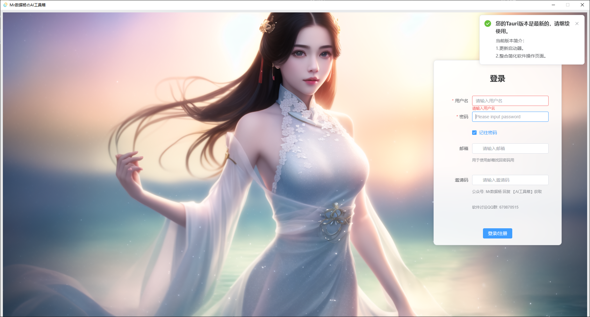

# MyToolsWebBackendUser

# 项目使用教程（使用前必看）

【QQ交流群群：670870515】获取最新动态。

# 功能与使用教程

使用模块可以复制模块名称到搜索栏或者按照模块位置进行点击后即可看到对应模块信息，点击选项卡即可进入功能页面。
## 音频工具

| 模块名称              | 模块位置 | 生产模式|功能描述            | 使用教程 |
|---------------------|--------|-------|--------------------|-------|
|  MicrosoftTTS 文本转语音 | Python音频技术   | 批量|使用微软API接口进行TTS文本转语音  | [点击跳转到使用教程](https://datayang.blog.csdn.net/article/details/142327534)  |
|  MoYinTTS  文本转语音  | Python音频技术 | 批量|使用魔音API接口进行TTS文本转语音   |[点击跳转到使用教程](https://datayang.blog.csdn.net/article/details/142327784)   |
|  FunAsr 音频识别  | Python音频技术 | 批量|使用本地模型FunAsr进行音频转字幕  |[点击跳转到使用教程](https://datayang.blog.csdn.net/article/details/142328866)   |
| FasterWhisper 音频识别 | Python音频技术 |批量| 使用本地模型FasterWhisper进行音频转字幕     | [点击跳转到使用教程](https://datayang.blog.csdn.net/article/details/142328988)  |

## 视频工具

| 模块名称              | 模块位置 |  生产模式|功能描述            | 使用教程 |
|---------------------|--------|-------|--------------------|-------|
|  视频素材混剪 | Python视频技术   |批量| 批量根据已的文稿结合素材库的视频进行视频操作 需要有文稿和片段素材库 |  [点击跳转到使用教程](https://datayang.blog.csdn.net/article/details/142329107)     |
|  音乐解说混剪| Python视频技术 |独立| 根据已有的视频素材进行每个片段介绍并拼接成完整视频 需要准备片段素材库  |  [点击跳转到使用教程](https://datayang.blog.csdn.net/article/details/142329122)     |
|  百叶窗卡点视频| Python视频技术  | 独立|根据已有的图片素材和选择的音频素材制作卡点百叶窗视频 支持横版/竖版 需要准备图片素材和音频文件  |  [点击跳转到使用教程](https://datayang.blog.csdn.net/article/details/142329145)   |
| 视频克隆（纯解说）| Python视频技术  |批量|批量根据已有的影视剧解说视频重洗解说文案并重新生成新的解说视频 需要提前对解说的视频文件进行字幕/图像处理  |  [点击跳转到使用教程](https://datayang.blog.csdn.net/article/details/142329159)    |
| 视频综合去重 | Python视频技术  |批量/独立|提供多种视频去重的方式对原有的视频文件进行处理，实现视频素材的基础处理。 |  [点击跳转到使用教程](https://datayang.blog.csdn.net/article/details/142426216)    |
|  短剧解说FunAsr | Python视频技术   |独立| 自己动解析视频音频身份，利用AI进行解说洗稿再次合成 使用前先进行自定义去重操作。 |  [点击跳转到使用教程]()     |
|  短剧剧情推理Story | Python视频技术   |独立| 根据用户对白进行自动解析生成片段，利用AI进行解说洗稿再次合成 使用前先进行自定义去重操作。 |  [点击跳转到使用教程]()     |
|  直播内容音频自动切割 | Python视频技术   |独立| 解析直播音频自动过滤掉无用片段 按照片段生成片段音频。 |  [点击跳转到使用教程]()     |
|  视频场景自由切割 | Python视频技术   |批量| 解析视频动态切割视频片段 并支持自动切割导出全部片段。 |  [点击跳转到使用教程]()     |
## 爬虫工具
| 模块名称              | 模块位置 |  生产模式|功能描述            | 使用教程 |
|---------------------|--------|-------|--------------------|-------|
|  YouGet视频下载  | Python网络爬虫   |独立| 支持市面上大多数视频网站的内容下载 部分高清视频需要用户验证。 |  [点击跳转到使用教程]()     |
|  YouGet视频下载  | Python网络爬虫   |批量/独立| 支持油管视频独立链接和关联词搜索批量下载 确保自己的网络可以直接访问油管。 |  [点击跳转到使用教程]()     |

## 直播工具
| 模块名称              | 模块位置 |  生产模式|功能描述            | 使用教程 |
|---------------------|--------|-------|--------------------|-------|
| 无人直播文案  | 直播工具   |独立| 解析直播文案，AI自动过滤掉无用的部分并整理成新的话术片段并保存成音频。 |  [点击跳转到使用教程]()     |
## SEO工具
| 模块名称              | 模块位置 |  生产模式|功能描述            | 使用教程 |
|---------------------|--------|-------|--------------------|-------|
|  AI文章撰写上稿网站 | SEO网络技术   |批量| 根据编辑好的网站分类、栏目、标签设置进行自动文章撰写 需要配合LM Studio生产文章上稿到站点， |  [点击跳转到使用教程]()     |
# 软件安装（整合包）

整个程序包约18G，集成了Python、ffmpeg、git环境，解压即用。

[Tauri AI工具箱一键包](https://pan.baidu.com/s/1tYkkhXKp6RBAgz6cNLUDKw?pwd=9dsh)

**首先需要安装显卡驱动，暂时只支持N卡，为了处理视频加速。**
**首先需要安装显卡驱动，暂时只支持N卡，为了处理视频加速。**
**首先需要安装显卡驱动，暂时只支持N卡，为了处理视频加速。**

解压缩 `02.项目使用的字体，自己解压缩到系统字体目录.rar` ，复制里面的全部文件到`C:\Windows\Fonts`目录下，如果有重复的字体覆盖即可。

根据自己的情况解压缩一键包一键包解压完成完成后会看到新的执行程序，以后每次启动程序会自动执行更新操作。

打开之后点击一键启动即可。

执行后会弹出CMD命令行窗口，当看到登录界面后关闭命令行窗口即可。

# 软件安装（源码）

**进行注册并登录后，邀请码请在公众号中获取。**

下载后需要先安装`01.[更新程序必装]Git-2.46.1-64-bit.exe`，打开程序之后默认一路下一步点下去安装接口。

在 `git` 中 [MyToolsWebBackendUser](https://gitee.com/escaflowne/MyToolsWebBackendUser) 进行项目克隆。

也可以在 `github` 中  [MyToolsWebBackendUser](https://github.com/Escaflowne1985/MyToolsWebBackendUser) 进行后端代码的获取。

然后在文件夹下生成一个目录 `MyToolsWebBackendUser`，打开后是这样的，其中`dv3admin`和`models`文件夹要自己创建，整合包不需要。

点击这里[下载 dv3admin后端环境](https://pan.baidu.com/s/1KcXU0er0ipGwznsFrFvQIA?pwd=67w7 )。下载后并解压到该处，解压后是这样的。

点击这里[下载 models模型文件](https://pan.baidu.com/s/1Z-GdlwoDU4HWqOcUAjHZsw?pwd=6cp1 )。下载后并解压到该处，解压后是这样的。

至此前期的准备工作就完事了，也可以直接下载首次完整包，就是比较大。

# 基础环境使用

## 配置基础配音API

进入用户选项卡，选择通用文本转语音方式，这里推荐使用微软TTS，后续会增加更多API配音模块。

|模块名称|资费|
|-|-|
|MicrosoftTTS| 1字符=1积分|
|MoYinTTS|1字符=4积分|

在用户选项卡记得选择配音的消费方式。

选择之后记得点击保存，保存成功后会有提示。
## 文本转配音设置

这里的文本转语音配置将应用于整个软件全部使用该业务的模块，因此必须要配置。

**MicrosoftTTS 微软文本转音频** 

进入主页选择，在搜索栏输入 `MicrosoftTTS` 。

点击`MicrosoftTTS`后进入页面，在这里配置好配音的基础参数后点击保存即可。

**MoYin 魔音文本转音频** 

进入主页选择，在搜索栏输入 `MoYinTTS` 。

点击`MoYinTTS`后进入页面，在这里配置好配音的基础参数后点击保存即可。

# 项目更新日志

2024-11-11

1. 更新ComfyUI工作流 洗图穿衣模特无限混搭工作流

2024-09-14

1. 优化启动，内置后端服务启动按钮。
2. 微软，魔音文本转语音
3. FunAsr，FasterWhisper音频转文本/字幕
4. 视频片段混剪拼接
5. 音节讲解混剪拼接
6. 音乐卡点百叶窗
7. 批量视频混剪
8. 网红字体
9. 影视解说克隆，需要自行处理素材

