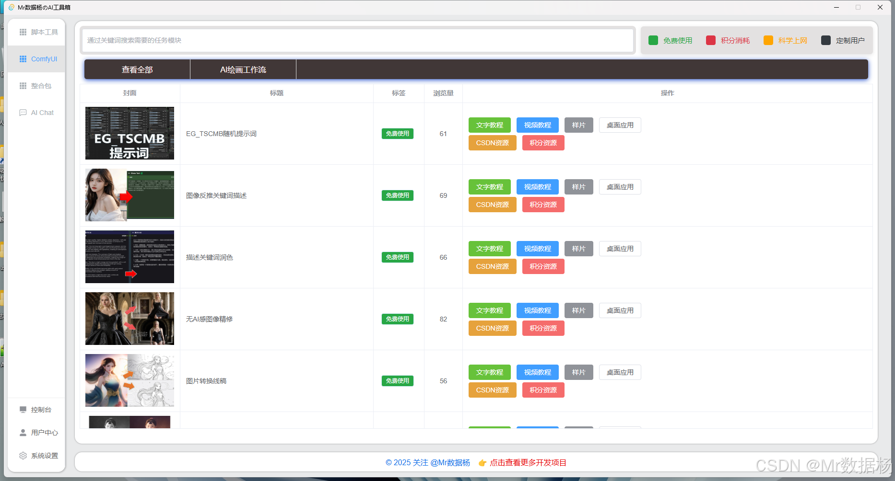

# MyToolsWebBackendUser

【QQ交流群群：670870515】获取最新动态。

基于Tauri作为前端打包exe应用程序适配多种平台，结合Django Web后台框架实现AI工具箱前后分离，并且也支持局域网使用一台管理后台多台机器同时使用。

**脚本工具**

**ComfyUI**

**整合包**

**AI Chat对话**

这种应用程序体积非常小，打包仅仅5MB都不到功能还在持续完善中，功能会增加在本文中持续更新。

🚨需要安装显卡驱动，暂时只支持N卡，为了处理视频加速。🚨

🚨需要安装显卡驱动，暂时只支持N卡，为了处理视频加速。🚨

🚨需要安装显卡驱动，暂时只支持N卡，为了处理视频加速。🚨

# 项目更新日志

2025-05-17
1. 优化调整短剧解说FunAsr模块。
2. 优化调整短剧剧情推理模块。
3. 优化调整直播内容音频自动切割模块。

2025-05-11

1. 优化调整YouGet视频下载模块。
2. 优化调整YtDlp视频下载模块。
3. 优化调整视频场景自由切割模块。

2025-05-10

1. 优化调整视频克隆（纯解说），素材去重模块。
2. 优化调整百叶窗卡点视频模块。
3. 优化AI文章撰写上高网站模块，新增网络API接口服务撰写。

2025-05-03

1. 优化服务端TTS和ChatGPT管理服务，应用新的插件框架。
2. 优化调整通用文本转语音，通用音频转文本模块。
3. 优化调整文稿AI视频混剪，视频AI介绍自动剪辑模块。

2025-05-01

1. 重新调整菜单分类。
2. 优化控制台，用户中心，系统设置。

2025-04-21

1. 桌面程序全新改版为 Tauri 2.x 版本，桌面程序需要重新安装无法自动更新。

2025-02-28

1. 调整整个UI样式和布局。
2. 所有相似工具模块合并。
3. 增加小说推文，文生视频模块，支持ComfyUI工作流生产。
4. 增加800+角色的ChatGPT功能。
5. 优化整合包，启动器功能移入客户端。
6. 客户端支持自动更新。

2025-02-07

1. 美化UI功能，调整优化工作流。
2. 优化所有使用模块文件名称中包含特殊字符无法使用的问题。
3. 调整大模型接口为Kimi，调整GPT使用积分消耗。
4. 统一调整输出目录，在设置中配置。

2024-12-06

1. 更新ComfyUI工作流 图像提取线条画面。

2024-12-05

1. 更新ComfyUI工作流 文本润色方法。 2.优化微软TTS文本转语音生成速度。

2024-11-29

1. 更新ComfyUI工作流 多种方法识别图像生成画面描述。

2024-11-27

1. 更新ComfyUI工作流 重绘去AI感工作流。

2024-11-11

1. 更新ComfyUI工作流 洗图穿衣模特无限混搭工作流。

2024-09-14

1. 优化启动，内置后端服务启动按钮。
2. 微软，魔音文本转语音。
3. FunAsr，FasterWhisper音频转文本/字幕。
4. 视频片段混剪拼接。
5. 音节讲解混剪拼接。
6. 音乐卡点百叶窗。
7. 批量视频混剪。
8. 网红字体。
9. 影视解说克隆，需要自行处理素材。

