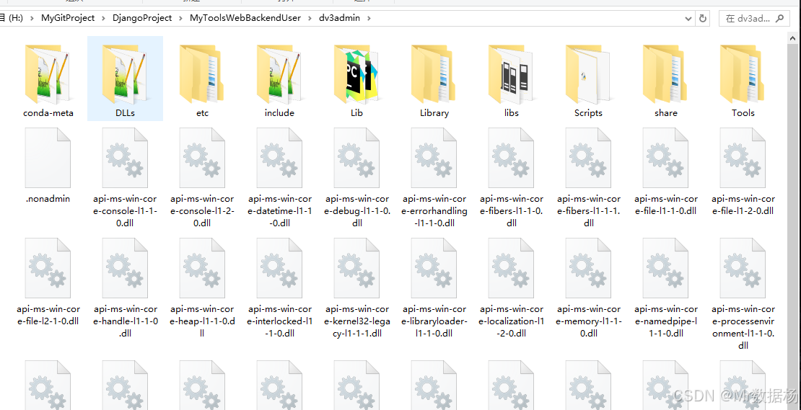

# MyToolsWebBackendUser

# 项目使用教程（使用前必看）

【QQ交流群群：670870515】获取最新动态。

项目启动器可以在群文件下载，当前最新版本 v1.03，启动器放在项目下打开即可。

# 功能与使用教程

使用模块可以复制模块名称到搜索栏或者按照模块位置进行点击后即可看到对应模块信息，点击选项卡即可进入功能页面。

# 功能与使用教程

使用模块可以复制模块名称到搜索栏或者按照模块位置进行点击后即可看到对应模块信息，点击选项卡即可进入功能页面。

**音频tools**

| 模块名称                  | 生产模式     | 功能描述                                       | 文字教程                                                                                       | 视频教程                                                          | 样片视频      |
|--------------------------|--------------|------------------------------------------------|-----------------------------------------------------------------------------------------------|------------------------------------------------------------------|---------------|
| FunAsr音频识别            | 独立 /批量        | 高精度音频识别                                 | [跳转链接](https://datayang.blog.csdn.net/article/details/142328866)                         | [跳转链接](https://www.bilibili.com/video/BV1nUztYHE7n/)         | [待更新](#)    |
| FasterWhisper音频识别       | 独立/批量         | 使用Whisper技术实现更快的音频识别                   | [跳转链接](https://datayang.blog.csdn.net/article/details/142328988)                         | [跳转链接](https://www.bilibili.com/video/BV19kBRYjEtH/)         | [待更新](#)    |
| MicrosoftTTS文本转语音      | 独立/批量         | 利用Microsoft技术从文本生成语音                     | [跳转链接](https://datayang.blog.csdn.net/article/details/142327534)                         | [跳转链接](https://www.bilibili.com/video/BV1CdiBY1Ete/)         | [待更新](#)    |
| MoYinTTS文本转语音         | 独立/批量         | 使用MoYin技术从文本生成具有特定声音特征的语音         | [跳转链接](https://datayang.blog.csdn.net/article/details/142327784)                         | [跳转链接](https://www.bilibili.com/video/BV1m2iBYQEfq/)         | [待更新](#)    |

**视频tools**

| 模块名称               | 生产模式   | 功能描述                                       | 文字教程                                                                                       | 视频教程                                                          | 样片视频                                  |
|------------------------|------------|------------------------------------------------|-----------------------------------------------------------------------------------------------|------------------------------------------------------------------|-------------------------------------------|
| 视频素材混剪            | 独立       | 结合多种视频素材进行创意混剪                     | [跳转链接](https://datayang.blog.csdn.net/article/details/142329107)                         | [跳转链接](https://www.bilibili.com/video/BV1DqBjYKERd/)         | [跳转链接](https://www.bilibili.com/video/BV1SM4m1y7cP/) |
| 音乐解说混剪            | 独立       | 结合音乐和解说进行视频混剪                       | [跳转链接](https://datayang.blog.csdn.net/article/details/142329122)                         | [待更新](#)                                                       | [跳转链接](https://www.bilibili.com/video/BV1NrtGerECE/) |
| 百叶窗卡点视频          | 独立       | 使用百叶窗效果进行视频卡点编辑                     | [跳转链接](https://datayang.blog.csdn.net/article/details/142329145)                         | [待更新](#)                                                       | [跳转链接](https://www.bilibili.com/video/BV1CbtVeBEV3/) |
| 视频克隆（纯解说）       | 独立/批量       | 仅使用解说进行视频内容克隆                         | [跳转链接](https://datayang.blog.csdn.net/article/details/142329159)                         | [待更新](#)                                                       | [跳转链接](https://www.bilibili.com/video/BV1f9tGeaE98/) |
| 视频综合去重            | 独立       | 对视频内容进行综合去重处理                         | [跳转链接](https://datayang.blog.csdn.net/article/details/142426216)                         | [待更新](#)                                                       | [跳转链接](https://www.bilibili.com/video/BV1dPs6efEi7/) |
| 批量视频综合去重         | 独立/批量       | 批量处理视频内容进行综合去重                       | [跳转链接](https://datayang.blog.csdn.net/article/details/142426216)                         | [待更新](#)                                                       | [跳转链接](https://www.bilibili.com/video/BV1dPs6efEi7/) |
| 短剧解说FunAsr         | 独立       | 使用FunAsr技术为短剧提供解说                       | [跳转链接](https://datayang.blog.csdn.net/article/details/144429656)                         | [待更新](#)                                                       | [跳转链接](https://www.bilibili.com/video/BV1DgqzYFEdu/) |
| 短剧剧情推理Story       | 独立       | 为短剧提供剧情推理支持                             | [跳转链接](https://datayang.blog.csdn.net/article/details/144429846)                         | [待更新](#)                                                       | [跳转链接](https://www.bilibili.com/video/BV18gqzYFE1n/) |
| 直播内容音频自动切割      | 独立       | 自动切割直播内容中的音频部分                       | [跳转链接](https://datayang.blog.csdn.net/article/details/144430380)                         | [待更新](#)                                                       | [待更新](#)                                      |
| 视频场景自动切割         | 独立/批量       | 自动切割视频中的不同场景                           | [跳转链接](https://datayang.blog.csdn.net/article/details/144429908)                         | [待更新](#)                                                       | [待更新](#)                                      |

**视频下载**

| 模块名称            | 生产模式     | 功能描述                                               | 文字教程                                                                                       | 视频教程                                                          | 样片视频      |
|---------------------|--------------|--------------------------------------------------------|-----------------------------------------------------------------------------------------------|------------------------------------------------------------------|---------------|
| YouGet视频下载       | 独立         | 支持市面上大多数视频网站的内容下载，部分高清视频可能需要用户验证。 | [跳转链接](https://datayang.blog.csdn.net/article/details/144429420)                         | [跳转链接](https://www.bilibili.com/video/BV18GqzYZEMX/)         | [待更新](#)    |
| YtDlp油管视频下载    | 批量/独立     | 支持油管视频的独立链接下载及关联词搜索的批量下载，需确保网络环境可以直接访问油管。 | [跳转链接](https://datayang.blog.csdn.net/article/details/144429451)                         | [跳转链接](https://www.bilibili.com/video/BV1SGqzYZEbK/)         | [待更新](#)    |

**AI文章撰写**

| 模块名称             | 生产模式   | 功能描述                                           | 文字教程                                                                                       | 视频教程   | 样片视频   |
|----------------------|------------|----------------------------------------------------|-----------------------------------------------------------------------------------------------|-----------|------------|
| AI文章撰写上稿网站    | 独立       | 利用AI技术帮助用户撰写和优化文章内容                 | [跳转链接](https://datayang.blog.csdn.net/article/details/144430355)                         | [待更新](#) | [待更新](#) |

**服装穿搭**

| 模块名称           | 生产模式   | 功能描述                                       | 文字教程                                                                                       | 视频教程                                                          | 样片视频      |
|---------------------|------------|------------------------------------------------|-----------------------------------------------------------------------------------------------|------------------------------------------------------------------|---------------|
| 模特穿衣无限混搭       | 独立       | 使用AI技术帮助模特实现多样化的服装搭配               | [跳转链接](https://datayang.blog.csdn.net/article/details/143773912)                         | [跳转链接](https://www.bilibili.com/video/BV14wqhYYEsd/)         | [待更新](#)    |

**图像重绘**

| 模块名称             | 生产模式   | 功能描述                                           | 文字教程                                                                                       | 视频教程   | 样片视频   |
|----------------------|------------|----------------------------------------------------|-----------------------------------------------------------------------------------------------|-----------|------------|
| 重绘去除画面AI感      | 独立       | 使用AI技术消除图像的人工痕迹，提升自然感               | [跳转链接](https://datayang.blog.csdn.net/article/details/143976345)                         | [待更新](#) | [待更新](#) |

**图像转换**

| 模块名称       | 生产模式   | 功能描述                                       | 文字教程                                                                                       | 视频教程   | 样片视频   |
|----------------|------------|------------------------------------------------|-----------------------------------------------------------------------------------------------|-----------|------------|
| 线稿草图生成       | 独立       | 从原始图片生成线稿草图                             | [跳转链接](https://datayang.blog.csdn.net/article/details/144293187)                         | [待更新](#) | [待更新](#) |

**图像加工**

| 模块名称             | 生产模式   | 功能描述                                       | 文字教程                                                                                       | 视频教程                                                          | 样片视频      |
|----------------------|------------|------------------------------------------------|-----------------------------------------------------------------------------------------------|------------------------------------------------------------------|---------------|
| 人物抠图换背景        | 独立       | 为人物照片快速更换背景                             | [跳转链接](https://datayang.blog.csdn.net/article/details/144430984)                         | [待更新](#) | [待更新](#)    |
| 图像8K放大            | 独立       | 将图像分辨率提升至8K级别                           | [跳转链接](https://datayang.blog.csdn.net/article/details/144431035)                         | [待更新](#) | [待更新](#)    |
| FLUX图像缩放          | 独立       | 使用FLUX算法对图像进行高质量缩放                     | [跳转链接](https://datayang.blog.csdn.net/article/details/144431052)                         | [待更新](#) | [待更新](#)    |
| SUPIR图像超细节缩放    | 独立       | 提升图像细节在进行缩放时的保留率                     | [跳转链接](https://datayang.blog.csdn.net/article/details/144431104)                         | [待更新](#) | [待更新](#)    |

**关键词**

| 模块名称             | 生产模式   | 功能描述                                       | 文字教程                                                                                       | 视频教程   | 样片视频   |
|----------------------|------------|------------------------------------------------|-----------------------------------------------------------------------------------------------|-----------|------------|
| EG_TSCMB随机提示词    | 独立       | 生成与图像相关的随机提示词                         | [跳转链接](https://datayang.blog.csdn.net/article/details/144430999)                         | [待更新](#) | [待更新](#)    |
| 图像反推关键词描述      | 独立       | 通过图像内容反推生成描述性关键词                     | [跳转链接](https://datayang.blog.csdn.net/article/details/144216319)                         | [待更新](#) | [待更新](#)    |
| 描述关键词润色          | 独立       | 优化和润色已有描述的关键词以增加吸引力                 | [跳转链接](https://datayang.blog.csdn.net/article/details/144293167)                         | [待更新](#) | [待更新](#)    |

# 软件安装（整合包）

整个程序包约18G，集成了Python、ffmpeg、git环境，解压即用。

[Tauri AI工具箱一键包](https://pan.baidu.com/s/1tYkkhXKp6RBAgz6cNLUDKw?pwd=9dsh)

**首先需要安装显卡驱动，暂时只支持N卡，为了处理视频加速。**
**首先需要安装显卡驱动，暂时只支持N卡，为了处理视频加速。**
**首先需要安装显卡驱动，暂时只支持N卡，为了处理视频加速。**

解压缩 `02.项目使用的字体，自己解压缩到系统字体目录.rar` ，复制里面的全部文件到`C:\Windows\Fonts`目录下，如果有重复的字体覆盖即可。

根据自己的情况解压缩一键包一键包解压完成完成后会看到新的执行程序，以后每次启动程序会自动执行更新操作。

打开之后点击一键启动即可。

执行后会弹出CMD命令行窗口，当看到登录界面后关闭命令行窗口即可。

# 软件安装（源码）

**进行注册并登录后，邀请码请在公众号中获取。**

下载后需要先安装`01.[更新程序必装]Git-2.46.1-64-bit.exe`，打开程序之后默认一路下一步点下去安装接口。

在 `git` 中 [MyToolsWebBackendUser](https://gitee.com/escaflowne/MyToolsWebBackendUser) 进行项目克隆。

也可以在 `github` 中  [MyToolsWebBackendUser](https://github.com/Escaflowne1985/MyToolsWebBackendUser) 进行后端代码的获取。

然后在文件夹下生成一个目录 `MyToolsWebBackendUser`，打开后是这样的，其中`dv3admin`和`models`文件夹要自己创建，整合包不需要。

点击这里[下载 dv3admin后端环境](https://pan.baidu.com/s/1KcXU0er0ipGwznsFrFvQIA?pwd=67w7 )。下载后并解压到该处，解压后是这样的。

点击这里[下载 models模型文件](https://pan.baidu.com/s/1Z-GdlwoDU4HWqOcUAjHZsw?pwd=6cp1 )。下载后并解压到该处，解压后是这样的。

至此前期的准备工作就完事了，也可以直接下载首次完整包，就是比较大。

# 基础环境使用

## 配置基础配音API

进入用户选项卡，选择通用文本转语音方式，这里推荐使用微软TTS，后续会增加更多API配音模块。

|模块名称|资费|
|-|-|
|MicrosoftTTS| 1字符=1积分|
|MoYinTTS|1字符=4积分|

在用户选项卡记得选择配音的消费方式。

选择之后记得点击保存，保存成功后会有提示。
## 文本转配音设置

这里的文本转语音配置将应用于整个软件全部使用该业务的模块，因此必须要配置。

**MicrosoftTTS 微软文本转音频** 

进入主页选择，在搜索栏输入 `MicrosoftTTS` 。

点击`MicrosoftTTS`后进入页面，在这里配置好配音的基础参数后点击保存即可。

**MoYin 魔音文本转音频** 

进入主页选择，在搜索栏输入 `MoYinTTS` 。

点击`MoYinTTS`后进入页面，在这里配置好配音的基础参数后点击保存即可。

# 项目更新日志

2024-12-06

1.更新ComfyUI工作流 图像提取线条画面。

2024-12-05

1.更新ComfyUI工作流 文本润色方法。
2.优化微软TTS文本转语音生成速度。

2024-11-29

1. 更新ComfyUI工作流 多种方法识别图像生成画面描述。

2024-11-27

1. 更新ComfyUI工作流 重绘去AI感工作流。

2024-11-11

1. 更新ComfyUI工作流 洗图穿衣模特无限混搭工作流。

2024-09-14

1. 优化启动，内置后端服务启动按钮。
2. 微软，魔音文本转语音。
3. FunAsr，FasterWhisper音频转文本/字幕。
4. 视频片段混剪拼接。
5. 音节讲解混剪拼接。
6. 音乐卡点百叶窗。
7. 批量视频混剪。
8. 网红字体。
9. 影视解说克隆，需要自行处理素材。

