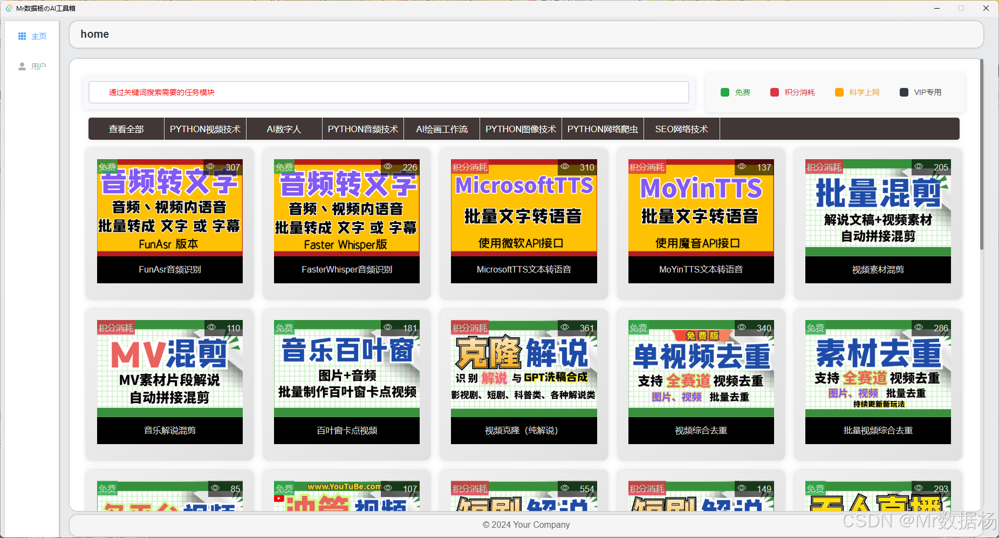
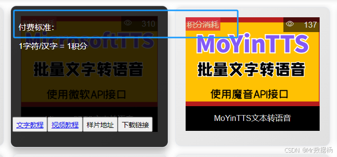

# 基础环境使用

进入软件后会看到用户选项，用于基础配置和消费。

还会看到业务功能选项，用于日常生产。

## 通用积分消耗

进入用户选项卡，选择通用文本转语音方式，这里推荐使用微软TTS，后续会增加更多API配音模块。选择之后记得点击保存，保存成功后会有提示。

| 模块名称     | 资费         | 用途                       |
| ------------ | ------------ | -------------------------- |
| MicrosoftTTS | 1字符=1积分  | 用于工具内的文本转语音业务 |
| MoYinTTS     | 1字符=4积分  | 用于工具内的文本转语音业务 |
| ChatGPT      | 1token=3积分 | 用于使用GPT功能生产的业务  |

在用户选项卡记得选择配音的消费方式，ChatGPT是默认使用。

所有需要消耗积分付费的地方会在选项卡处有明确的提示，标记的模块如果没有积分是无法使用的。

## 文本转配音设置

这里的文本转语音配置将应用于整个软件全部使用该业务的模块，因此必须要配置。

**MicrosoftTTS 微软文本转音频** 

进入主页选择，在搜索栏输入 `MicrosoftTTS` 。点击`MicrosoftTTS`后进入页面，在这里配置好配音的基础参数后点击保存即可。

具体配置使用请参考 [我的AI工具箱Tauri版-MicrosoftTTS文本转语音](https://datayang.blog.csdn.net/article/details/142327534)。

**MoYin 魔音文本转音频** 

进入主页选择，在搜索栏输入 `MoYinTTS` 。点击`MoYinTTS`后进入页面，在这里配置好配音的基础参数后点击保存即可。

具体配置使用请参考 [我的AI工具箱Tauri版-MoYin文本转语音](https://datayang.blog.csdn.net/article/details/142327784)。

