# 软件安装（整合包）

**首先需要安装显卡驱动，暂时只支持N卡，为了处理视频加速。**
**首先需要安装显卡驱动，暂时只支持N卡，为了处理视频加速。**
**首先需要安装显卡驱动，暂时只支持N卡，为了处理视频加速。**

整个程序包约18G，集成了Python、ffmpeg、git环境，解压即用。

## Django+Tarui桌面服务

整合包下载地址，如果下载地址失效请联系管理员，整合包大小约18G左右。

| 网盘名称 | 下载地址                                                     |
| -------- | ------------------------------------------------------------ |
| 百度     | [百度网盘 Tauri AI工具箱一键整合包包](https://pan.baidu.com/s/1hDyt0CnSmjU0fSJBHa0_RQ?pwd=wgvn) |

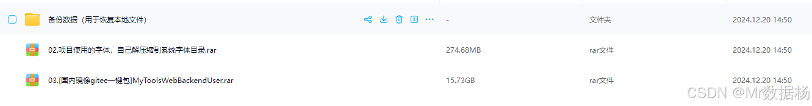

解压缩 `02.项目使用的字体，自己解压缩到系统字体目录.rar` ，复制里面的全部文件到 `C:\Windows\Fonts` 目录下，如果有重复的字体覆盖即可。

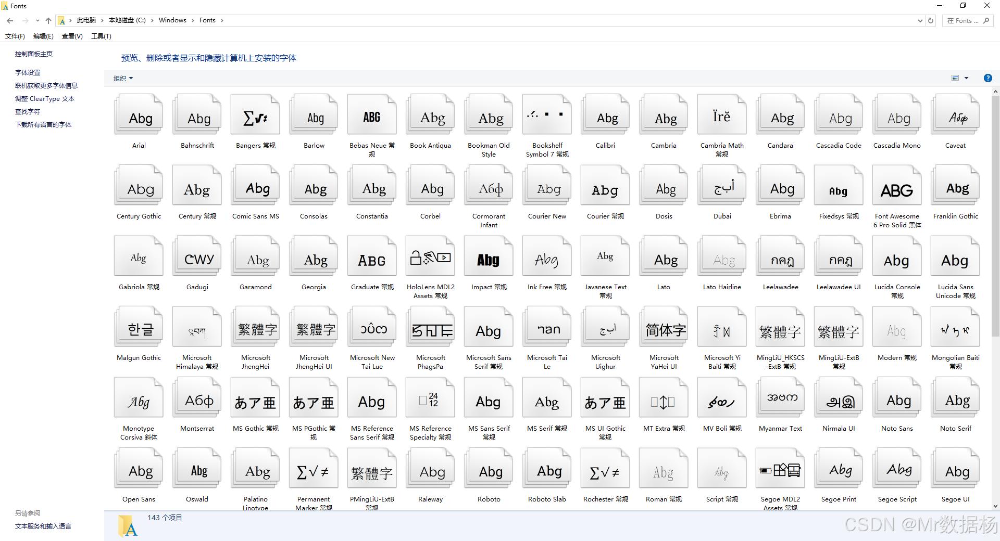

根据自己的情况解压缩一键包解压完成完成后会看到新的执行程序，以后每次启动程序会自动执行更新操作。
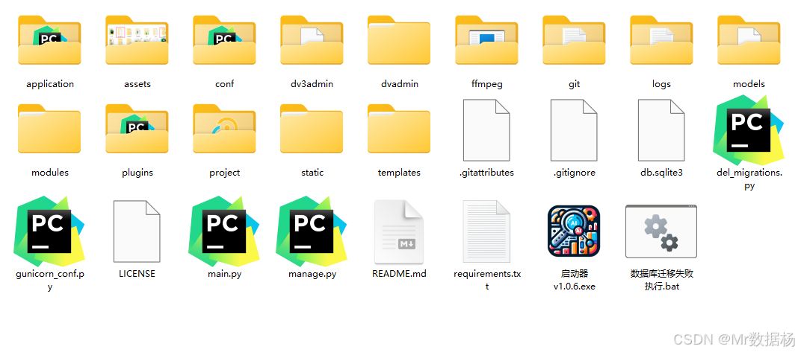

打开 `启动器 xxxx.exe` 启动程序服务，当前服务需要开启 `Django` 后端以及 `Tauri` 桌面程序2套服务，根据自己实际情况选择对应的模块启动，然后点击一键启动就会执行选择的模块。

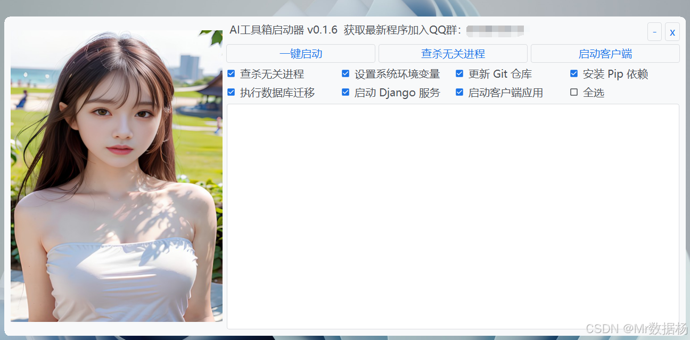

执行后会弹出CMD命令行窗口，当看到登录界面后关闭命令行窗口即可。

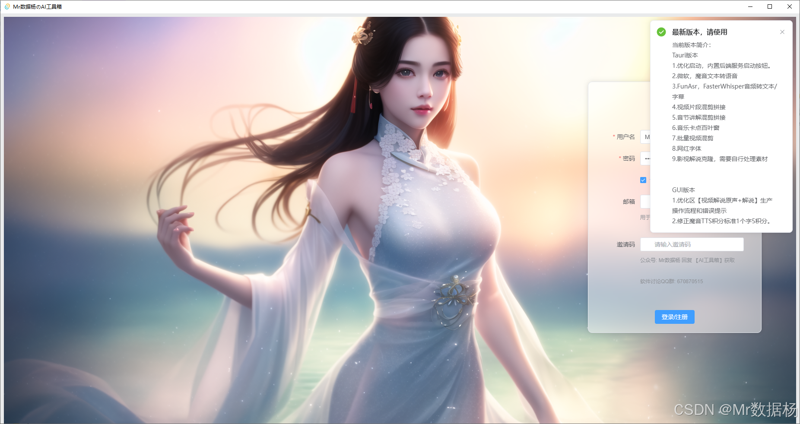

## ComfyUI 工作流

整合包下载地址，如果下载地址失效请联系管理员，整合包大小约980GB。

| 网盘名称 | 下载地址                                                     |
| -------- | ------------------------------------------------------------ |
| 百度     | [百度网盘 sd-ComfyUI 工作流一键整合包包](https://pan.baidu.com/s/1iJERH6sAcFE1KyRZixHNow?pwd=tneh) |

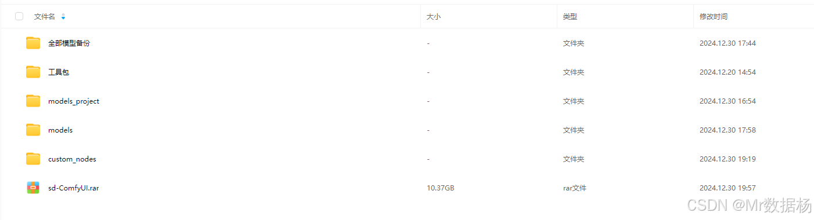

解压 `sd-ComfyUI` 后会看到目录，进入ComfyUI目录后看到秋叶启动器。

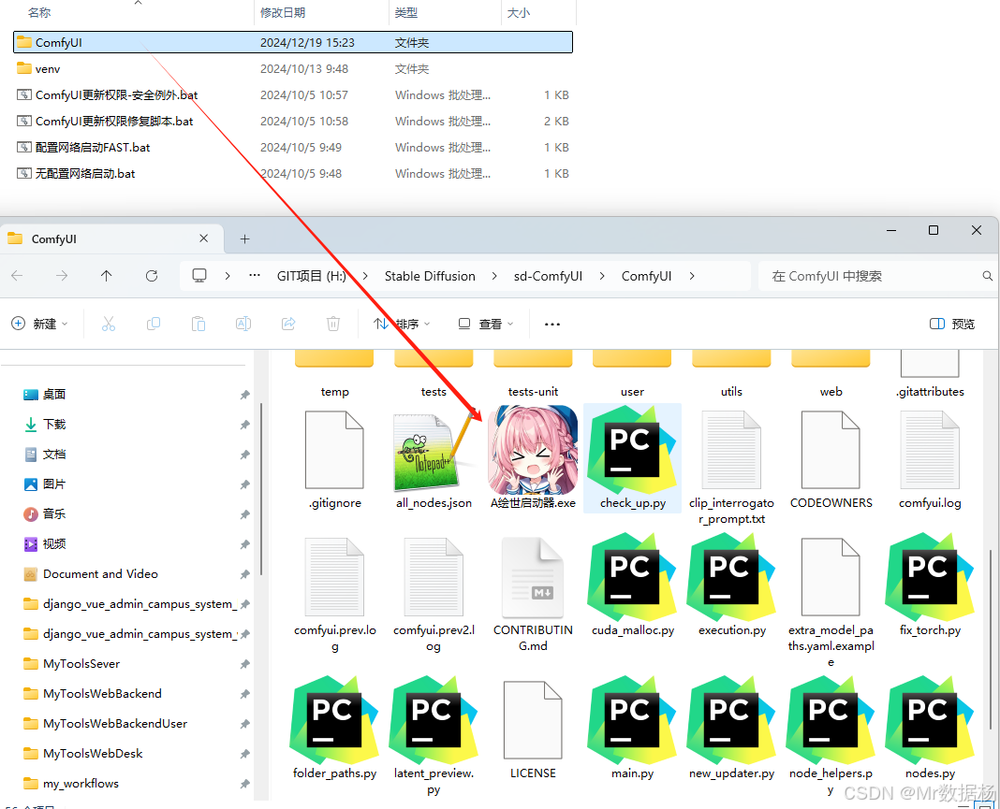
常规启动就好，这里有2个备份比较大的文件夹 `models` 和 `custom_nodes` 分别下载后解压到目录中。如果哪里的包有问题了可以直接下载来重新解压即可。

| 文件夹名称     | 解压目录               | 说明                                                         | 样例                                                         |
| -------------- | ---------------------- | ------------------------------------------------------------ | ------------------------------------------------------------ |
| models         | `\ComfyUI\models`      | 基础模型文件常规用到模型，直接放到解压目录下。               | 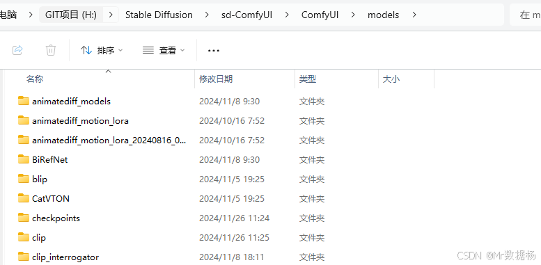 |
| 全部模型备份   | `\ComfyUI\models`      | 日常开发时候用到的全部整理后的模型文件，硬盘足够大的可以直接下这个。 |  |
| models_project | `\ComfyUI\models`      | 根据项目直接下载对应的模型文件覆盖到模型目录。               | 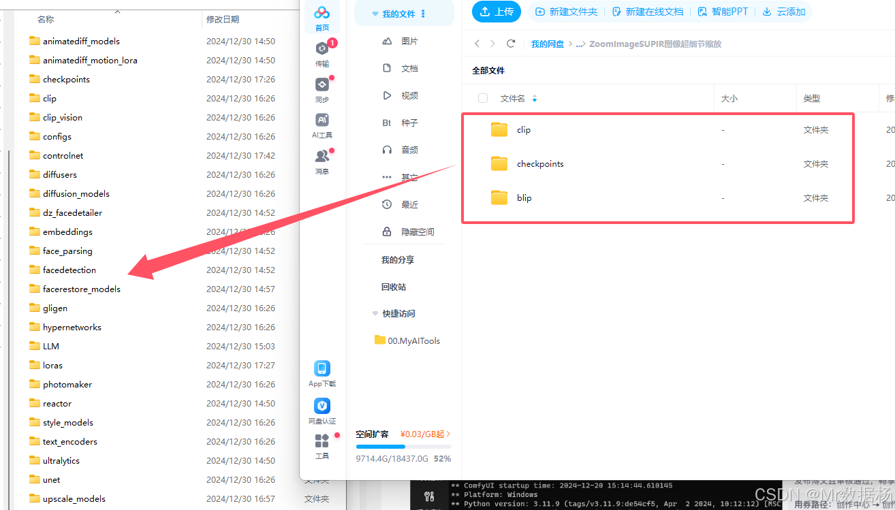 |
| custom_nodes   | `ComfyUI\custom_nodes` | 所有的使用的节点，如果哪个报错了直接从网盘下载最新的从新解压即可。 | 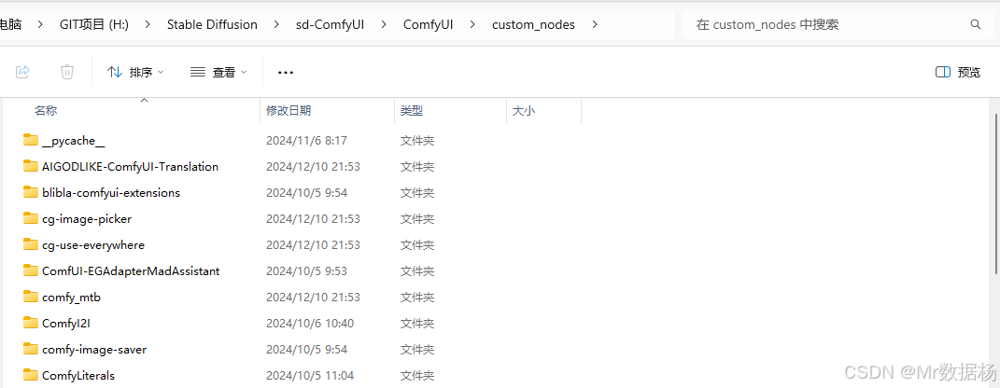 |

启动方式和常规一样一键启动即可。

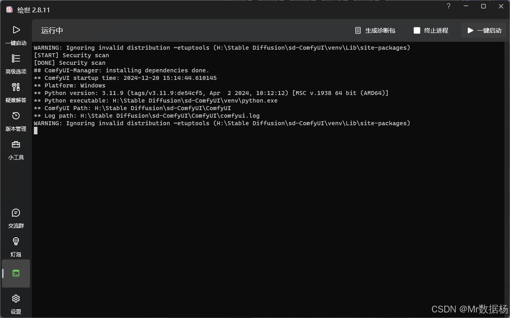